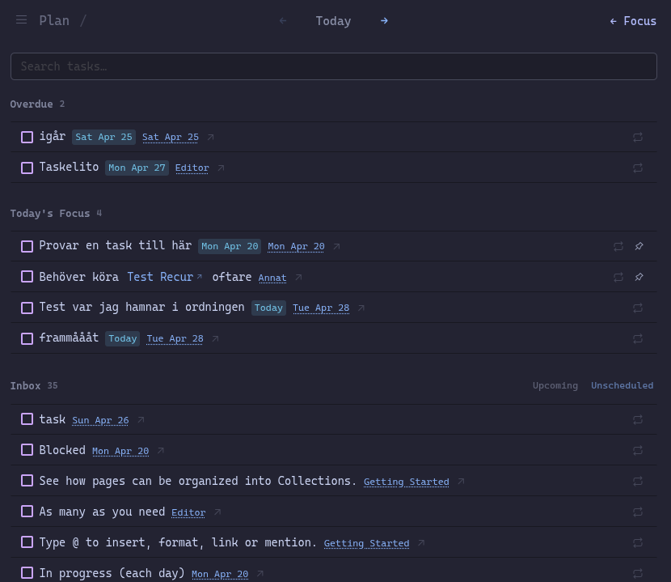
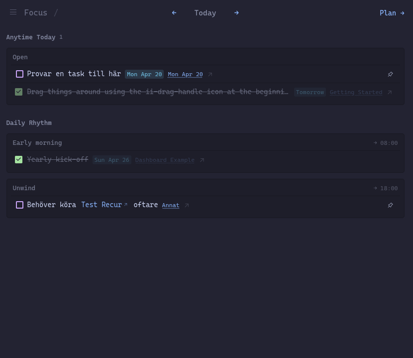
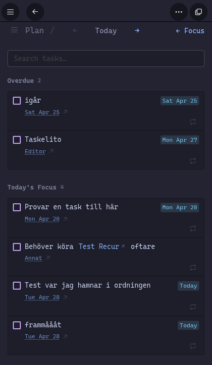
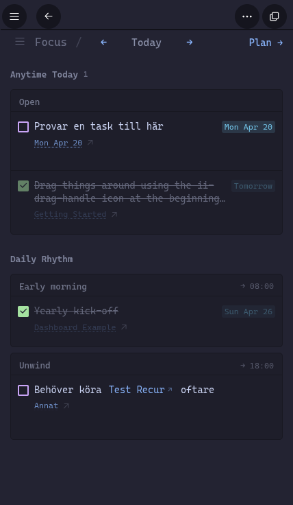

# Daily Focus - Tasks

**Type:** Global Plugin

A workspace-wide task manager that aggregates tasks from across your entire Thymer workspace. Operates in two modes — **Focus** for executing your day, **Plan** for deciding what matters.

## Screenshots

| Plan desktop | Focus desktop | Plan mobile | Focus mobile |
|---|---|---|---|
|  |  |  |  |

## Modes

### Focus

Shows what you're working on today, organized by time.

- **Unscheduled** — tasks pinned to today or scheduled for today without a time block
- **Day Plan** — time slots from Early Morning through Evening; tap a task to open a scheduling panel, then pick a slot to assign it. Tap the active slot again to unassign.

Navigate to past or future days with `←` / `→`. Future days show a dimmed preview of tasks that would recur on that day. Past days show a completion history for recurring tasks — completed occurrences appear with strikethrough, missed ones appear dimmed. Switch to Plan with the **Plan →** button.

### Plan

Used to decide what goes into your day.

- **Overdue** — tasks past their due date, highlighted in red
- **Today's Focus** — tasks pinned for today
- **Inbox** — undated todos, plus optionally upcoming tasks; filter with the **Unscheduled** and **Upcoming** buttons in the section header

Tap a task in Overdue or Inbox to pin it to Today's Focus. Remove it with `×`. Navigate forward to future dates with `←` / `→`. Switch back with **← Focus**.

### Recurring tasks

Accessible via the ☰ menu. Lists all tasks marked as recurring. Tap a row to expand and set its schedule — choose a frequency (daily / weekly / monthly / yearly) and, where applicable, a day. Remove the recurring setting via the trash icon.

Each recurring task exists as a single task forever — no copies are created. Checking it off advances the scheduled date to the next occurrence and resets it to undone, ready for next time. Past occurrences are tracked as ghost traces in the Focus history view.

### Ignore list

Accessible via the ☰ menu. Hide tasks from Plan and Focus without deleting them. Ignored tasks are listed separately and can be restored at any time with a single click.

## Menu

A hamburger menu (☰) sits in the top left corner of every view:

- **Focus** — switch to Focus mode
- **Plan** — switch to Plan mode
- **Recurring tasks** — manage recurring schedules
- **Ignore list** — hide tasks from Plan and Focus
- **Settings** — configure plugin behaviour

## Task interactions

- **Checkbox** — mark a task done (or undo from the done state). Done tasks appear with strikethrough and reduced opacity. For recurring tasks, checking off advances the date to the next occurrence instead of marking permanently done.
- **Repeat icon** — mark a task as recurring (defaults to daily) or remove its recurring schedule. Activating recurring clears any pin; removing recurring auto-pins the task to the current day.
- **Note reference chip** — if a task links to another note, it renders as a clickable chip with ↗; tap to open the note.
- **Due date chip** — tasks with a date show it inline next to the task name; overdue dates are highlighted in red.
- **Task status icon** — native Thymer task statuses (important, started, waiting, etc.) are reflected as icons on each row.
- **Source name / ↗ icon** — navigates directly to the task in its source document, scrolling to and highlighting it.
- **Pin icon** — unpin from Today's Focus. On mobile, "Remove from today" also appears in the scheduling sheet.
- **Task text** (Focus mode) — tap to open the scheduling panel; pick a time slot to assign the task, or tap the active slot to remove the assignment.

The dashboard refreshes automatically when tasks are created, updated, or completed elsewhere in the workspace.

## Known issues

**Mobile browser — blank screen after clearing cache or browser data**

If you clear your browser cache and browser data while the plugin is installed in your workspace, the mobile browser may fail to load all panels and meta-properties required to run plugins on the next visit, resulting in a blank screen.

**Fix:** switch your mobile browser to desktop mode, navigate around a little, then switch back to mobile mode and the app should load correctly on next visit.

## Changelog

### 2026-04-29
- **Mobile task layout** — task rows are easier to tap, with cleaner spacing between task text, due dates, and source links
- **Plan and Ignore list polish** — refreshed task lists to feel calmer and more consistent with Focus
- **Bottom sheets** — mobile sheets now behave more naturally and no longer fight with Thymer's bottom navigation
- **Recurring tasks** — improved the mobile scheduling experience and replaced the destructive-looking remove action with a calmer control
- **Fix** — completed tasks could show an unchecked box or place the checkbox awkwardly on mobile
- **Fix** — opening a source link on mobile could trigger from too much of the task row instead of just the source text or icon
- **Fix** — tasks pinned to Focus but left unfinished could stay stuck in history instead of returning to the planner the next day
- **Fix** — tasks from trashed or restored pages and collections now disappear or return after the dashboard refreshes

### 2026-04-27
- **Focus redesign** — time blocks feel lighter and more list-like; cleaner separation between blocks and tasks
- **Links in task names** — if a task references another note, it shows as a tappable link that opens the note directly
- **Due dates** — shown next to the task name; overdue dates turn red
- **Task status icons** — important, started, waiting and other native Thymer statuses now show up on each task row
- **Upcoming filter** — new toggle in Plan Inbox to show tasks due within the next 7 days
- **Fix** — toggling recurring on and off could leave a task in a weird state where it disappeared or got stuck

### 2026-04-26
- **Time block selection** — rebuilt for both mobile and desktop; tap a task to open a selection sheet, then pick a time slot or remove from Today's Focus
- **Search** — search box in Plan view filters Overdue and Inbox tasks in real time; × button clears the filter
- **Settings** — new view accessible via ☰; configure plugin behaviour. Current options: hide completed tasks in Focus, disable journal transclusions
- **Mobile** — unpin button and source link now visible on narrow screens; source truncated to 10 characters
- **Menu trigger** — clicking the hamburger icon or the view name opens the menu
- **Wipe Plugin Metadata** — new option under Settings → Data; removes all plugin data from tasks and clears plugin configuration
- **Fix** — journal transclusions now work correctly across multiple workspaces or accounts open in the same browser

### 2026-04-25 (recurring rethink)
- **One task forever** — recurring tasks no longer create copies on each occurrence; a single task advances to the next date when checked off
- **Ghost traces** — past days in Focus show recurring history: completed occurrences appear with strikethrough, missed ones appear dimmed
- **Bounded history** — missed ghost traces only appear from the date a recurring schedule was first set, not retroactively
- **Journal transclusion removed for recurring** — recurring completions are tracked in-plugin rather than via journal transclusions

### 2026-04-25
- **Instant UI** — panel opens immediately, no loading delay
- **Recurring preview** — future dates show a dimmed ghost of tasks that would recur that day
- **UI overhaul** — new design across all views
- **Journal transclusion** — completing a task automatically adds a transclusion to today's journal page
- **Native due dates** — recurring tasks show their scheduled date natively in Thymer; set immediately when configuring a recurring schedule

### 2026-04-24
- **Recurring tasks (experimental)** — mark tasks as recurring (daily / weekly / monthly / yearly); auto-generates occurrences and catches up in the background
- **Recurring tasks view** — accessible via ☰; tap a row to expand and edit its schedule

### 2026-04-23
- Added **☰ menu** — sits in the top left corner of every view, starting point for plugin settings and tools
- Added **Ignore list** — accessible via the ☰ menu. Hide tasks from Plan and Focus without deleting them. Restore at any time from the same view.
- **Source navigation** now scrolls to and highlights the specific task in its source document, not just the page

## Installation

1. Open Thymer and go to **Settings → Plugins**
2. Create a new **Global Plugin**
3. Paste the contents of `customCode.js` into the code editor
4. Paste the contents of `configuration.json` into the configuration editor
5. Save and activate the plugin

Access the dashboard via the sidebar icon or the command palette (`Open Daily Focus`).
