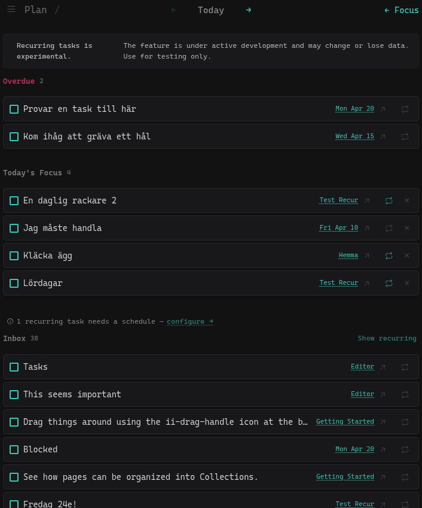
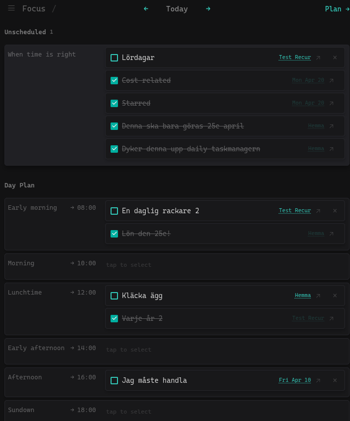
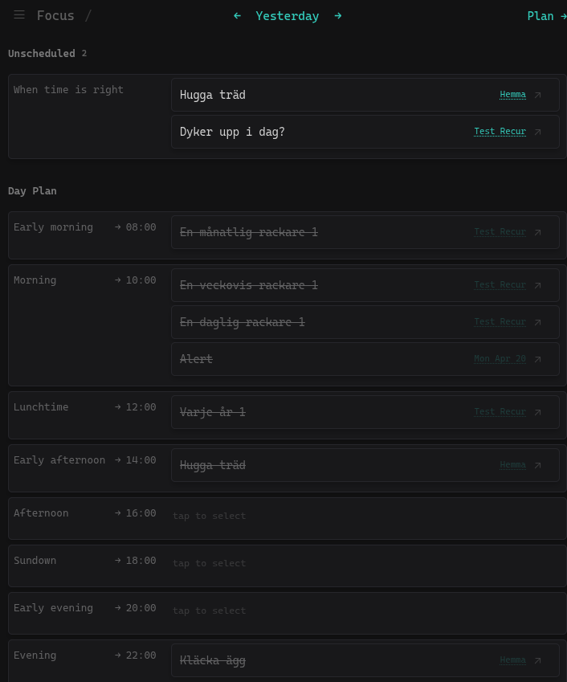
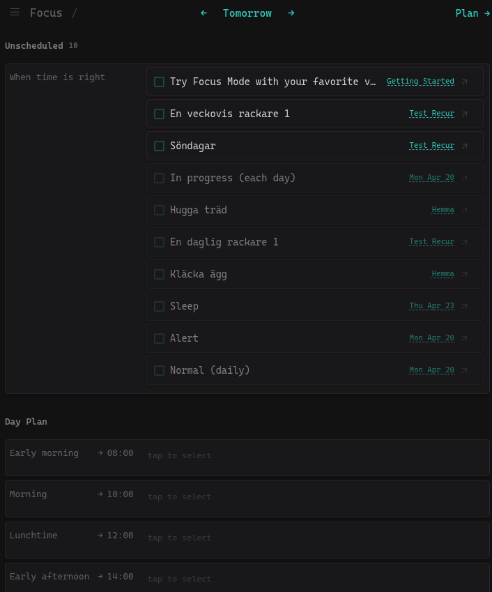

# Daily Focus Dashboard

**Type:** Global Plugin

A workspace-wide task dashboard that aggregates tasks from across your entire Thymer workspace. Operates in two modes — **Focus** for executing your day, **Plan** for deciding what matters.

## Screenshots

| Plan | Focus | History | Future |
|---|---|---|---|
|  |  |  |  |

## Modes

### Focus (default when tasks exist)

Shows what you're working on today, organized by time.

- **Unscheduled** — tasks pinned to today or scheduled for today that haven't been assigned a time block yet
- **Day Plan** — time slots from Early Morning through Evening; tap a task then a slot (or vice versa) to assign it

Navigate to past or future days using the `←` / `→` arrows in the header to review or plan other days.

Switch to Plan mode with the **Plan →** button in the header.

### Plan

Used to decide what goes into your day.

- **Overdue** — tasks past their due date, highlighted in red
- **Today's Focus** — tasks pinned for today
- **Inbox** — all undated todos with no scheduled date

Tap a task body in Overdue or Inbox to pin it to Today's Focus. Remove it with `×`. Switch back with the **← Focus** button.

### Ignore list

Accessible via the ☰ menu in the top left corner of any view. Ignore tasks to hide them from Plan and Focus without deleting them. Ignored tasks are listed separately and can be restored at any time with a single click.

## Menu

A hamburger menu (☰) sits in the top left corner of every view. Currently contains:

- **Ignore list** — hide tasks from Plan and Focus

## Task interactions

- **Circle button** — mark a task done (or undo it from the done state). Done tasks appear with strikethrough and reduced opacity.
- **Source name / arrow icon** — the source document name and `↗` icon are a single clickable area that navigates directly to the task itself in its source document, scrolling to and highlighting it.
- **× button** — unpin from Today's Focus or remove from a time block.
- **Task text** (in Focus mode) — tap to select a task, then tap a time block to assign it; tap again to deselect.

The dashboard refreshes automatically when tasks are created, updated, or completed elsewhere in the workspace.

## Changelog

### 2026-04-25
- **Instant UI** — panel opens immediately, no loading delay
- **Recurring preview** — future dates show a dimmed ghost of tasks that would recur that day
- **UI overhaul** — new design across all views

### 2026-04-24
- **Recurring tasks (experimental)** — mark tasks as recurring (daily / weekly / monthly / yearly); auto-generates occurrences and catches up in the background
- **Recurring tasks view** — accessible via ☰; tap a row to expand and edit its schedule

### 2026-04-23
- Added **☰ menu** — sits in the top left corner of every view, starting point for plugin settings and tools
- Added **Ignore list** — accessible via the ☰ menu. Hide tasks from Plan and Focus without deleting them. Restore at any time from the same view.
- **Source navigation** now scrolls to and highlights the specific task in its source document, not just the page

## Installation

1. Open Thymer and go to **Settings → Plugins**
2. Create a new **Global Plugin**
3. Paste the contents of `customCode.js` into the code editor
4. Paste the contents of `configuration.json` into the configuration editor
5. Save and activate the plugin

Access the dashboard via the sidebar icon or the command palette (`Open Daily Focus`).
